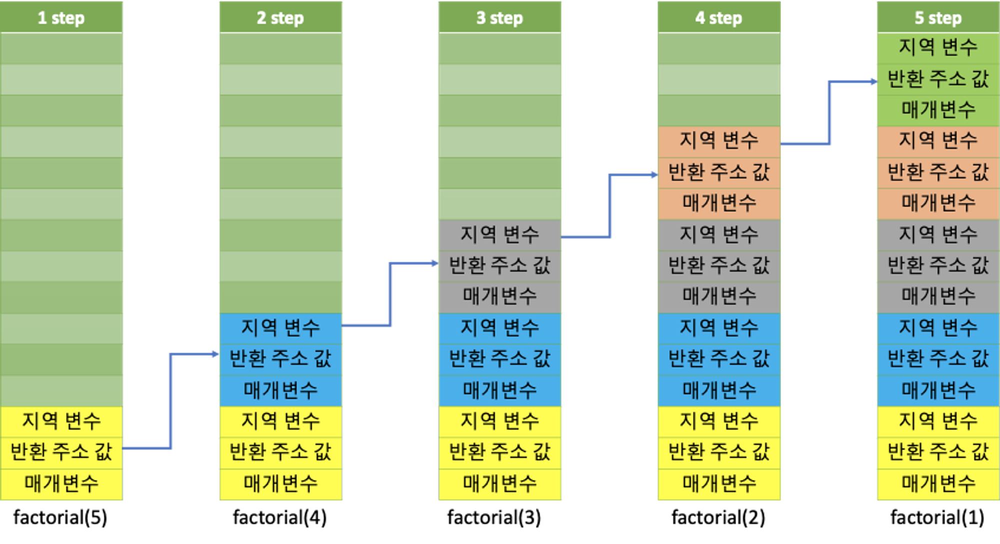

# 10~12장. 발표

생성일: 2024년 9월 9일 오후 2:46
상태: 스터디 완료
주차: 3주차

# 재귀 함수와 반복문의 비교

<aside>
 모던 자바스크립트 Deep Dive 12.7.2 재귀함수 (p.182)

---

”재귀 함수는 반복되는 처리를 반복문 없이 구현할 수 있다는 장점이 있지만 무한 반복에 빠질 위험이 있고, 이로 인해 스택 오버플로 에러를 발생시킬 수 있으므로 주의해서 사용해야 한다.
따라서 재귀 함수는 반복문을 사용하는 것보다 **재귀 함수를 사용하는 편이 더 직관적으로 이해하기 쉬울 때만 한정적으로 사용**하는 것이 바람직하다.”

</aside>

❓그렇다면 반복문과 재귀 함수 중 반복문이 어떤 식으로 더 성능이 좋은 걸까?

### 1. 재귀 함수와 반복문의 차이점

- 반복문

  ```jsx
  function factorial(num) {
    if (num <= 1) return 1

    var result = num
    while (--num) result *= num
    return result
  }
  ```

- 재귀 함수

  ```jsx
  function factorial(num) {
    if (num <= 1) return 1

    return num * factorial(num - 1)
  }
  ```

⇒ 사용하는 변수의 개수나, 코드 길이를 따져보았을 때 재귀를 사용하면 코드의 가독성이 좋아진다.

또한 복잡한 문제도 빠르고 단순하게 접근이 가능하다.

하지만 그 외에 극명한 장단점이 존재한다.

재귀 함수는 Stack 메모리를 사용하는데, 반복적으로 자기 자신을 부르면서 Stack에 계속해서 쌓여간다.

만약 이게 점점 쌓여 Stack의 모든 공간을 차지하고 여유 공간이 없어진다면 Stack Overflow가 발생한다.

이에 비해서 반복문은 Stack 메모리에 1번만 쌓이게 된다.



출처 - Catsbi’s DLog


<br>

<aside>
 스택 오버 플로우는 왜 발생하는 것일까?

---

먼저 메모리 구조를 보았을 때,

Heap의 영역과 Stack의 영역이 차지하는 방향이 서로 맞물리는 구조를 가지고 있다.

Stack가 점점 커져서 Heap을 침범하는 경우에 Stack Overflow가 발생하는 것이다.


steemit - @cicada

</aside>

만약 재귀가 딱 5번만 이뤄질 것을 단정할 수 있는 상황이라면 재귀를 사용해도 문제가 발생하지 않지만

복잡한 기능을 구현하거나, 사용하는 변수가 점점 많아질수록 이는 확실치 않은 상황이기에

재귀 함수를 사용하는 것을 피하는 개발자가 많은 것 같다.

또한 반복문과 비교를 해보았을 때

함수를 호출하고 종료하면서 지역변수, 매개변수, 반환값을 모두 Stack에 저장하는 등의

Stack 메모리를 구성하고 해제하는 과정에서

오버헤드(간접적인 처리 시간과 메모리)가 들기에 그 속도와 공간 또한 무시할 수 없다.

즉, 간결한 코드에 비해 속도 저하와 메모리 사용, 스택 오버 플로우 등의 치명적인 단점을 가지고 있다.

따라서 재귀 함수를 사용할 때에는 코드 크기가 작거나, 시간 복잡도가 문제가 되지 않거나,

<br>

### 2. 그럼에도 재귀 함수를 사용하는 이유가 있을까?

- 가장 큰 이유는 가독성과 직관적인 이해로 협업이 중요한 요즘, 개발자가 지향해야 할 읽기 좋은 코드이다.
  복잡한 문제도 단순한 로직의 반복 구조로 해결하고,
  함수 내에서 사용하는 변수의 개수와 코드 길이가 줄어들기에 읽기 좋은 코드가 될 수 있다.

<br>

### 3. 꼬리 재귀 기법?

- 결국 재귀 함수의 단점은 **메모리 사용**에 있다.
  즉, 자기 자신을 호출한 뒤 결과를 기다리면서 생기는 Stack의 부하로 인한 메모리낭비인 것이다.
  만약 이 단점을 보완할 수 있다면 어떨까? 여기서 나온 것이 **꼬리 재귀 기법**이다.
  꼬리 재귀는 재귀 호출이 반환되면서 ‘중단된 곳에서 계속’할 필요가 없다는 것을 깨닫는 것이다.

  <br>

  **일반 재귀 기법**

  ***

  ```jsx
  function sum(x) {
    if (x === 100) return x
    else return x + sum(x + 1)
  }

  sum(0)
  ```

  **꼬리 재귀 기법**

  ***

  ```jsx
  function tailSum(x, answer) {
    if (x > 100) return answer
    else return tailSum(x + 1, answer + x)
  }

  tailSum(0, 0)
  ```

  둘의 차이점은 return 문에 있다.
  일반 재귀의 경우 **함수가 return 된 후**에 연산이 일어나고,
  꼬리 재귀의 경우 **함수가 return 되기 전**에 연산이 일어나는 것을 볼 수 있다.
  즉 return문에서 재귀 호출 전에 문장이나 연산이 없어야 한다.
  꼬리 재귀를 사용한다면 재귀 호출이 끝나는 시점에 아무 일도 하지 않고
  **바로 결과를 반환하도록 하는 방법**으로 함수의 상태 유지 및 추가 연산을 하지 않기에
  Stack Overflow를 해결할 수 있다.
  하지만 이는 컴퍼일러가 꼬리 재귀 최적화를 지원한다는 가정하에 사용할 수 있다.
  따라서 컴파일러가 자체적으로 재귀함수를 해석하여 **반복문으로 변경하여 실행**하면서
  최적화를 지원해야 그 성능을 기대할 수 있다.

<br>

### 4. 결론

- 재귀 함수와 반복문의 사용은 시간 복잡도(메모리 사용)와 코드 크기에 따라 결정될 것 같다.
  **재귀 함수**는 동일한 코드를 다시 호출하는 것이므로 코드 길이가 짧지만
  그에 따른 시간 복잡도는 지수적으로 증가함으로 **코드가 짧지만 시간 복잡도가 높은 경우**에 유리할 것이다.
  시간 복잡도(메모리 사용)의 문제보다는 **코드의 단축**이 문제인 경우 재귀를 사용하는 것이 좋을 것이며,
  또한 **재귀 깊이가 예측 가능한 경우**에 사용하는 것이 안전할 것이다.
  반면 **반복문**은 코드 블록의 반복이므로 코드의 길이가 크지만 **시간 복잡도**가 초점인 경우 사용하는 것이 좋다.

<br>

### 5. 출처

- [형... 재귀함수가 뭐야?](https://youtu.be/RPSVXjcFbvA?t=12662)

- [재귀함수와 반복문의 차이, Difference between Recursion and Iteration - GeeksforGeeks](https://www.geeksforgeeks.org/difference-between-recursion-and-iteration/)
- [꼬리 재귀함수와 일반 재귀 함수, Why is Tail Recursion optimization faster than normal Recursion? - GeeksforGeeks](https://www.geeksforgeeks.org/why-is-tail-recursion-optimization-faster-than-normal-recursion/?ref=oin_asr1)
- [스택 오버 플로우, 코딩교육 티씨피스쿨](https://tcpschool.com/c/c_memory_stackframe)
